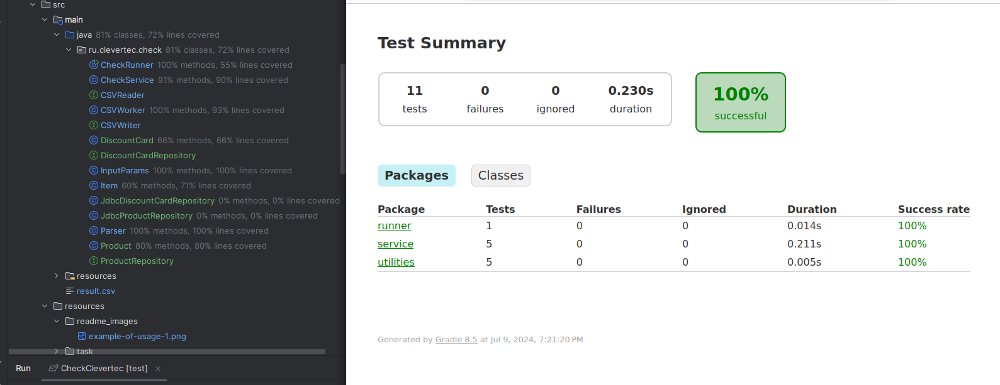

# Application for creating Check of products in console and CSV files
This repository contains 5 branches: feature/entry-core, feature/entry-file, feature/entry-database, feature/entry-rest, and feature/custom. Each of these branches contains different application functionality for creating checks with a different stack of technologies. This project was created for educational purposes to understand the workings of such technologies as Servlets API, JDBC, PostgreSQL, and so on.
## Table of Contents
- [Getting Started](#getting-started)
    - [Prerequisites](#prerequisites)
    - [Installation](#installation)
- [Example of usage](#example-of-usage)
- [Tests](#tests)
- [Note](#note)


## Getting Started
### Prerequisites
Make sure you have the following installed:
- Java (version 21 or higher)

## Installation

### Database for Linux Ubuntu

1. You need to install PostgreSQL on your Linux Ubuntu. You can read how to do this [here](https://www.digitalocean.com/community/tutorials/how-to-install-postgresql-on-ubuntu-20-04-quickstart).
2. Execute the following commands:
```bash
sudo -i -u postgres
 ```

```bash
createdb check;
 ```
```bash
psql
 ```
```bash
CREATE USER postgres WITH PASSWORD "postgres";
GRANT ALL PRIVILEGES ON DATABASE check TO postgres;
\q
 ```
or if user 'postgres' already exists: 
```bash
ALTER USER postgres WITH PASSWORD 'postgres';
 ```
3. Run the initialization scripts that are located in ./src/main/resources/data.sql

4. Clone the repository:
```bash
git clone https://github.com/vanzoneway/CheckClevertec.git
 ```
5. Compile the project into .jar file:
```bash
./gradlew jar
 ```

Note: You should execute this command from the CheckClevertec directory.

6. Run the application:
```bash
java -jar clevertec-check.jar id-quantity discountCard=xxxx balanceDebitCard=xxxx saveToFile=xxxx datasource.url=xxxx datasource.username=xxxx datasource.password=xxxx
```
Note:
1. id - product identifier (see Table 1)
2. quantity - quantity of the product
3. discountCard=xxxx - name and number of the discount card (Information about discount cards ./src/main/resources/discountCards.csv)
4. balanceDebitCard=xxxx - balance on the debit card
5. saveToFile - specify the path to the file from the root of the project, where you plan to write the result.
6. datasource.url=xxxx - url to database (example jdbc:postgresql://localhost:5432/check)
7. datasource.username=xxxx - username for database ( example postgres )
8. datasource.password=xxxx - password for database ( example postgres )
- The result of running the program is stored in ./src/main/result.csv

WARNING:
- If saveToFile is missing - the error is written to src/main/result.csv

## Example of usage

```bash
java -jar clevertec-check.jar 3-1 2-5 5-1 discountCard=1111 balanceDebitCard=100 saveToFile=./result.csv datasource.url=jdbc:postgresql://localhost:5432/check datasource.username=postgres datasource.password=postgres
```


## Tests
To run tests, you can use the following command
```bash
./gradlew test
```
You can view the test results at the following path: ./build/reports/tests/test/index.html


## Note
You can read all the information about the Task at src/main/resources/task (see Task 3 and all its appendices). 