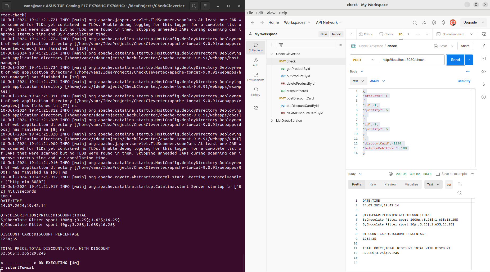

# Application for creating Check of products in console and CSV files
This repository contains 5 branches: feature/entry-core, feature/entry-file, feature/entry-database, feature/entry-rest, and feature/custom. Each of these branches contains different application functionality for creating checks with a different stack of technologies. This project was created for educational purposes to understand the workings of such technologies as Servlets API, JDBC, PostgreSQL, and so on.
## Table of Contents
- [Getting Started](#getting-started)
    - [Prerequisites](#prerequisites)
    - [Installation](#installation)
- [Example of usage](#example-of-usage)
- [Note](#note)


## Getting Started
### Prerequisites
Make sure you have the following installed:
- Java (version 17 or higher)

## Installation

1. Clone the repository:
```bash
git clone https://github.com/vanzoneway/CheckClevertec.git
 ```
2. Compile the project:
```bash
javac -d out -cp src src/main/java/ru/clevertec/check/*.java
 ```
Note: You should execute this command from the CheckClevertec directory. The compiled classes will be located in the out folder. The -cp flag indicates where to find all the source files.
3. Run the application:
```bash
java -cp out ./src/main/java/ru/clevertec/check/CheckRunner.java id-quantity discountCard=xxxx
balanceDebitCard=xxxx
```
Note:
1. id - product identifier (see Table 1)
2. quantity - quantity of the product
3. discountCard=xxxx - name and number of the discount card (Information about discount cards ./src/main/resources/discountCards.csv)
4. balanceDebitCard=xxxx - balance on the debit card

Information about products: ./src/main/resources/products.csv
The result of running the program is stored in src/main/result.csv

## Example of usage




## Note
You can read all the information about the Task at src/main/resources/task (see Task 1 and all its appendices). 